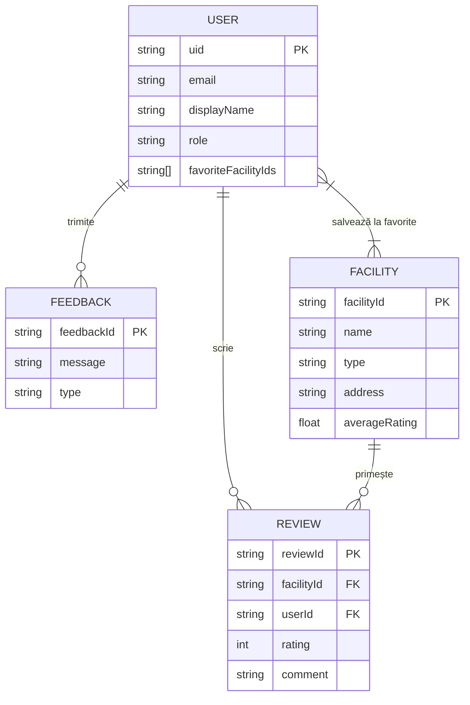
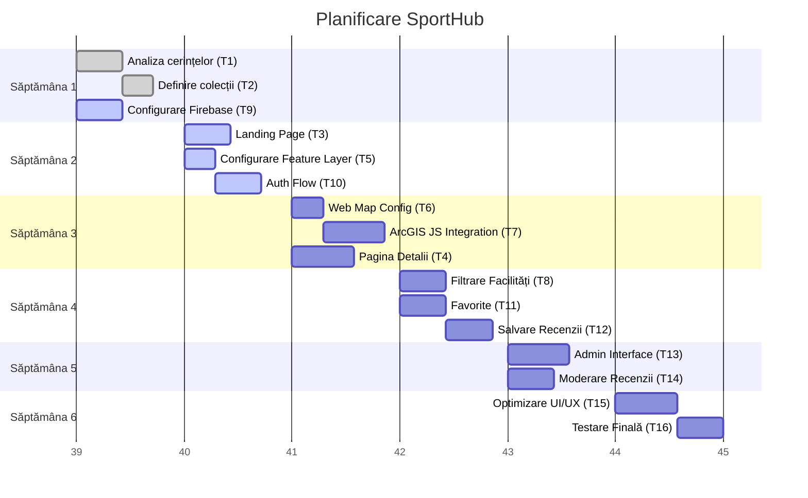

# SportHub
## Hartă interactivă a facilităților sportive

**Echipă:**
- ENACHE Alexia-Ioana  
- FICHIOŞ Mara  
- PETREA Bogdan-Vasile  

**Tehnologii principale:** Web (HTML, CSS, JavaScript) + Firebase + ArcGIS Online  

---

## 1. Descriere generală a aplicației

SportHub este o aplicație web care afișează pe o hartă interactivă principalele facilități sportive (terenuri de fotbal, baschet, săli de fitness, bazine de înot, piste de alergare etc.) dintr-o anumită zonă geografică (oraș / județ).

Utilizatorii pot:
- să caute facilități sportive după tip (fotbal, baschet, înot etc.),
- să filtreze după distanță față de poziția lor,
- să vizualizeze detalii (program, nivel de preț, contact),
- să lase recenzii și rating-uri,
- să salveze facilități la „favorite”.

Admin-ul poate:
- să adauge/editeze/șteargă facilități,
- să modereze recenzii nepotrivite.

Aplicația folosește:
- **ArcGIS Online + ArcGIS JavaScript API** pentru harta interactivă și feature layer-ul cu facilități sportive,
- **Firebase** pentru autentificare, stocarea utilizatorilor, recenziilor și a listelor de favorite,
- **Firebase Hosting** pentru publicarea aplicației web.

---

## 2. Structurarea datelor

### 2.1 Tipul de stocare a datelor

Vom folosi următoarele tipuri de stocare:

1. **Bază de date non-relațională – Firebase Cloud Firestore**  
   - pentru date despre utilizatori, recenzii, favorite și meta-informații despre facilitățile sportive;

2. **Servicii GIS (ArcGIS Online) – feature layer-e**  
   - pentru geometria (coordonatele) facilităților sportive și atributele lor principale;

3. **Fișiere în cloud – Firebase Storage**  
   - pentru imaginile (fotografii) încărcate de utilizatori sau administratori (poze ale terenurilor, sălilor etc.).

Nu vom folosi o bază de date relațională clasică (MySQL / PostgreSQL), deoarece Firestore este suficient pentru modele de date relativ simple și se integrează direct cu frontend-ul web și cu Firebase Authentication.

### 2.2 Structura colecțiilor în Cloud Firestore

Vom folosi următoarele colecții (echivalentul „tabelelor” într-o BD relațională):

#### 2.2.1 Colecția `users`

Conține conturile utilizatorilor autentificați.

Câmpuri:
- `uid` (string, cheie primară – ID-ul utilizatorului din Firebase Auth)
- `email` (string)
- `displayName` (string)
- `photoUrl` (string, opțional – link spre Firebase Storage sau avatar extern)
- `createdAt` (timestamp)
- `favoriteFacilityIds` (array\<string>) – ID-uri de facilități salvate la favorite
- `role` (string) – valori posibile: `"user"`, `"admin"`

#### 2.2.2 Colecția `facilities`

Conține meta-informații despre facilitățile sportive. Geometria (punctul pe hartă) este stocată în feature layer-ul ArcGIS, iar în Firestore păstrăm ID-uri și date suplimentare.

Câmpuri:
- `facilityId` (string, cheie primară, sincronizată cu OBJECTID sau alt ID din feature layer)
- `name` (string)
- `type` (string) – ex.: fotbal, baschet, tenis, înot, fitness, alergare
- `description` (string)
- `priceLevel` (string) – ex.: gratuit, low, medium, high
- `phone` (string)
- `website` (string)
- `address` (string)
- `averageRating` (number, 0–5)
- `reviewCount` (number)
- `createdBy` (string, uid utilizator sau `"admin"`)
- `createdAt` (timestamp)
- `updatedAt` (timestamp)

#### 2.2.3 Colecția `reviews`

Recenziile utilizatorilor pentru fiecare facilitate.

Câmpuri:
- `reviewId` (string, cheie primară)
- `facilityId` (string, referință la `facilities.facilityId`)
- `userId` (string, referință la `users.uid`)
- `rating` (number, 1–5)
- `comment` (string)
- `createdAt` (timestamp)
- `status` (string) – ex.: `approved`, `pending`, `rejected`

#### 2.2.4 Colecția `feedback`

Opțional – feedback general pentru aplicație (bug-uri, sugestii).

Câmpuri:
- `feedbackId` (string)
- `userId` (string, opțional)
- `message` (string)
- `createdAt` (timestamp)
- `type` (string) – ex.: `bug`, `suggestion`, `other`

### 2.3 Structura datelor în ArcGIS Online – Feature Layer

Vom crea un feature layer în ArcGIS Online, care va conține entitățile „Facilități sportive” (puncte pe hartă).

Atribute principale feature layer:
- `OBJECTID` (ID intern ArcGIS)
- `facilityId` (string – sincronizat cu Firestore)
- `name` (string)
- `type` (string)
- `address` (string)
- `hasLighting` (boolean – teren iluminat)
- `isIndoor` (boolean – interior / exterior)
- `openedHours` (string, ex.: `08:00–22:00`)
- `photoUrl` (string, link spre Firebase Storage)
- **geometrie:** punct (latitudine, longitudine)

### 2.4 Relații dintre date – „diagrama bazei de date”

Deși Firestore este NoSQL, putem reprezenta conceptual relațiile dintre entități astfel:

- **User**
  - câmpuri: `uid`, `email`, `displayName`, `photoUrl`, `role`, `favoriteFacilityIds`, `createdAt`
  - relații:
    - trimite **Feedback**
    - are **favorite** către **Facility**
    - scrie **Review**

- **Facility**
  - câmpuri: `facilityId`, `name`, `type`, `description`, `priceLevel`, `phone`, `website`, `address`, `averageRating`, `reviewCount`, `createdBy`, `createdAt`, `updatedAt`
  - relații:
    - primește **Review** de la **User**
    - este marcată ca **favorite** de **User**

- **Review**
  - câmpuri: `reviewId`, `facilityId`, `userId`, `rating`, `comment`, `status`, `createdAt`
  - relații:
    - aparține unui **User**
    - aparține unei **Facility**

- **Feedback**
  - câmpuri: `feedbackId`, `userId`, `message`, `type`, `createdAt`
  - relații:
    - este trimis de un **User** (opțional anonim)

### 2.4 Relații dintre date – „diagrama bazei de date”

Deși Firestore este NoSQL, putem reprezenta conceptual relațiile dintre entități astfel:



---

## 3. Arhitectura generală a aplicației

### 3.1 Niveluri arhitecturale

Aplicația are o arhitectură client-centrică (SPA simplă) cu următoarele componente principale:

1. **Frontend Web (Client)**
   - HTML5 + CSS3 + JavaScript  
   - UI responsiv (desktop)  
   - Integrare ArcGIS JavaScript API pentru afișarea hărții, feature layer, popup-uri  
   - Integrare SDK Firebase pentru autenticare și Firestore  

2. **Servicii backend gestionate (Backend-as-a-Service)**
   - Firebase Authentication – login cu e-mail/parolă (și eventual Google)  
   - Firebase Cloud Firestore – stocare utilizatori, recenzii, meta-data facilități  
   - Firebase Storage – stocare imagini  
   - Firebase Hosting – găzduirea aplicației web  

3. **Servicii GIS (ArcGIS Online)**
   - Web Map public/privat cu layer-ul „Facilități sportive”  
   - Feature layer cu atribute, configurat cu popup-uri de bază  
   - Consumate din aplicație prin ArcGIS JavaScript API  

### 3.2 Diagrama de arhitectură (schemă bloc)

### 3.2 Diagrama de arhitectură (schemă bloc)

```mermaid
graph TD
    subgraph Client [Client Side]
        WebApp[Aplicație Web\n(HTML/CSS/JS)]
    end

    subgraph Firebase [Backend - Firebase]
        Auth[Authentication]
        Firestore[Cloud Firestore\n(Date)]
        Storage[Storage\n(Imagini)]
        Hosting[Hosting]
    end

    subgraph ArcGIS [GIS - ArcGIS Online]
        ArcGIS_JS[ArcGIS JS API]
        FeatureLayer[Feature Layer\n(Facilități Sportive)]
        Basemap[Basemap]
    end

    WebApp -->|Autentificare| Auth
    WebApp -->|CRUD Date| Firestore
    WebApp -->|Upload/Download| Storage
    WebApp -.->|Load App| Hosting

    WebApp -->|Afișare Hartă| ArcGIS_JS
    ArcGIS_JS -->|Interogare| FeatureLayer
    ArcGIS_JS -->|Tiles| Basemap
```

---

## 4. Diagrama cazurilor de utilizare

### 4.1 Actori

- Utilizator neautentificat (Vizitator)
- Utilizator autentificat
- Administrator

### 4.2 Use case-uri principale

#### Pentru Utilizator neautentificat:
- Vizualizare hartă cu facilități sportive
- Filtrare facilități după tip
- Vizualizare detalii facilități
- Înregistrare cont
- Autentificare

#### Pentru Utilizator autentificat:
- Toate cele de mai sus, plus:
- Adăugare recenzie + rating
- Editare / ștergere recenzie proprie
- Adăugare / eliminare facilitate la favorite
- Trimitere feedback aplicație

#### Pentru Administrator:
- Adăugare facilitate nouă
- Editare date facilitate
- Ștergere facilitate
- Moderare recenzii (aprobare / respingere)
- Vizualizare feedbackuri

### 4.3 Diagramă de use case (schematic)

### 4.3 Diagramă de use case (schematic)

```mermaid
usecaseDiagram
    actor "Vizitator" as Guest
    actor "Utilizator Autentificat" as User
    actor "Administrator" as Admin

    package "SportHub" {
        usecase "Vizualizare Hartă" as UC1
        usecase "Căutare/Filtrare Facilități" as UC2
        usecase "Vizualizare Detalii" as UC3
        usecase "Înregistrare / Login" as UC4
        
        usecase "Adăugare Recenzie" as UC5
        usecase "Gestionare Favorite" as UC6
        usecase "Trimitere Feedback" as UC7
        
        usecase "CRUD Facilități" as UC8
        usecase "Moderare Recenzii" as UC9
    }

    Guest --> UC1
    Guest --> UC2
    Guest --> UC3
    Guest --> UC4

    User --> UC1
    User --> UC2
    User --> UC3
    User --> UC4
    User --> UC5
    User --> UC6
    User --> UC7

    Admin --> UC1
    Admin --> UC2
    Admin --> UC3
    Admin --> UC4
    Admin --> UC5
    Admin --> UC6
    Admin --> UC7
    Admin --> UC8
    Admin --> UC9

    User --|> Guest
    Admin --|> User
```

---

## 5. Tehnologii

### 5.1 Tehnologii generale

- **Frontend:**
  - HTML5
  - CSS3 (eventual cu framework CSS – ex. Bootstrap / TailwindCSS)
  - JavaScript (ES6+)

- **GIS:**
  - ArcGIS Online (crearea web map-ului și a feature layer-ului)
  - ArcGIS JavaScript API (încărcarea hărții, feature layer, popup-uri)

- **Backend & stocare:**
  - Firebase Authentication
  - Firebase Cloud Firestore
  - Firebase Storage
  - Firebase Hosting

- **Altele:**
  - Git / GitHub pentru versionare și colaborare
  - VS Code ca mediu de dezvoltare

### 5.2 Tehnologii specifice pe componente

#### 5.2.1 Feature layer „Facilități sportive”

- **Tehnologie:** Portal ArcGIS Online  
- **Detalii:**
  - Crearea unui Feature Layer (Hosted) de tip „Point”
  - Definirea câmpurilor (`name`, `type`, `address`, `photoUrl` etc.)
  - Populare inițială cu câteva facilități (date demo)
  - Configurarea web map-ului ce va fi consumat de aplicația web

#### 5.2.2 Harta și popup-urile

- **Tehnologie:** ArcGIS JavaScript API  
- **Module principale (exemple):**
  - `esri/Map`
  - `esri/views/MapView`
  - `esri/layers/FeatureLayer`
  - `esri/widgets/Search`
  - `esri/PopupTemplate`

**Utilizare:**
- `FeatureLayer` pentru încărcarea layer-ului „Facilități sportive”
- `PopupTemplate` pentru configurarea informațiilor afișate la click:
  - numele facilității,
  - tipul,
  - adresa,
  - rating mediu (preluat fie din câmp layer, fie din Firestore),
  - link către pagina de detalii.

#### 5.2.3 Autentificare utilizatori

- **Tehnologie:** Firebase Authentication  
- **Metode:**
  - Email + parolă (minim)
  - Opțional: autentificare cu Google  

**Integrare:**
- Formulare HTML + JavaScript
- Apeluri la `firebase.auth()` pentru `signUp`, `signIn`, `signOut`
- Stocarea datelor suplimentare în colecția `users` din Firestore

#### 5.2.4 Stocarea recenziilor și a favoritelor

- **Tehnologie:** Firebase Cloud Firestore  

**Pattern:**
- Colecție `reviews`, interogată prin `facilityId`
- Câmp `favoriteFacilityIds` în `users`

**Operații:**
- `add()` pentru a salva recenzii noi
- `update()` pentru recalcularea ratingului mediu în `facilities`
- `arrayUnion()` / `arrayRemove()` pentru favorite

#### 5.2.5 Stocarea imaginilor

- **Tehnologie:** Firebase Storage  

**Utilizare:**
- Upload imagini din formular de admin sau din partea de recenzii
- Obținere URL public al imaginii
- Salvarea URL-ului în `facilities.photoUrl` sau într-un subdocument dedicat

#### 5.2.6 Găzduirea aplicației

- **Tehnologie:** Firebase Hosting  

**Utilizare:**
- Deploy versiune finală a aplicației
- Asigurarea accesului HTTPS
- Integrare simplă cu restul serviciilor Firebase

---

## 6. Organizarea activităților

### 6.1 Lista de task-uri și asignarea pe membri

**ENACHE Alexia-Ioana**
- Task 1: Analiza cerințelor și scrierea descrierii funcționalităților principale
- Task 2: Definirea colecțiilor în Firestore (`users`, `facilities`, `reviews`)
- Task 3: Crearea paginii de prezentare (landing page: descriere aplicație, link către hartă)
- Task 4: Realizarea paginii de detalii pentru o facilitate (afișare date, recenzii, formular recenzie)
- Task 14: Implementarea moderării recenziilor (`approved` / `pending` / `rejected`)

**FICHIOŞ Mara**
- Task 5: Crearea și configurarea feature layer-ului „Facilități sportive” în ArcGIS Online
- Task 6: Configurarea web map-ului în ArcGIS Online (simbolizare, popup de bază)
- Task 7: Integrarea ArcGIS JavaScript API în aplicație (harta principală)
- Task 8: Implementarea filtrării facilităților după tip (fotbal, baschet etc.)
- Task 16: Testarea finală și remedierea bug-urilor, pregătirea demo-ului

**PETREA Bogdan-Vasile**
- Task 9: Configurarea proiectului Firebase (Auth, Firestore, Storage, Hosting)
- Task 10: Implementarea fluxului de autentificare (login, logout, register)
- Task 11: Implementarea funcționalității de „favorite” (adauga/elimina facilitate la favorite)
- Task 12: Implementarea salvării recenziilor și recalculării ratingului mediu
- Task 13: Implementarea interfeței pentru admin (formular adăugare / editare facilități)
- Task 15: Optimizarea UI/UX (design responsiv, layout, componente)

### 6.2 Diagrama Gantt (planificare pe săptămâni)

Presupunem o durată de 6 săptămâni.

### 6.2 Diagrama Gantt (planificare pe săptămâni)

Presupunem o durată de 6 săptămâni.



---

## 7. Identificarea riscurilor și măsuri de contracarare

### 7.1 Matrice de evaluare a riscurilor

| ID risc | Descriere risc                                              | Probabilitate | Impact | Nivel (P x I) | Măsuri de mitigare |
|--------|-------------------------------------------------------------|---------------|--------|---------------|--------------------|
| R1     | Lipsă de timp / proiectul nu este gata la termen           | Medie         | Mare   | Mediu–Mare    | Planificare pe task-uri mici, Gantt realist, întâlniri săptămânale în echipă |
| R2     | Probleme tehnice cu ArcGIS JS API (erori, learning curve)  | Medie         | Mediu  | Mediu         | Studii de caz simple, testare pe exemple oficiale, prototip rapid pentru hartă |
| R3     | Probleme de configurare Firebase (drepturi, reguli secur.) | Medie         | Mare   | Mediu–Mare    | Respectarea documentației Firebase, testare treptată, reguli de securitate simple |
| R4     | Un membru al echipei nu mai poate participa                | Mică–Medie    | Mare   | Mediu         | Distribuție redundantă a competențelor, documentare minimă a codului, code review |
| R5     | Depășirea cotelor gratuite (quota) la Firebase / ArcGIS    | Mică          | Mediu  | Mic–Mediu     | Limitarea volumului de date, folosirea unui număr mic de feature-uri pentru demo |
| R6     | Bug-uri critice descoperite foarte târziu                  | Medie         | Mare   | Mediu–Mare    | Testare incrementală după fiecare feature, scenarii de test de bază, code review |

### 7.2 Măsuri generale de risk mitigation

- Planificare realistă: spargerea proiectului în task-uri mici, cu deadline-uri interne.
- Comunicare: întâlniri de echipă (online sau fizic) săptămânale pentru status și blocaje.
- Versionare: folosirea Git/GitHub pentru a evita pierderea codului și conflicte majore.
- Prototipare: implementarea rapidă a unei versiuni foarte simple (hartă + câteva facilități) la mijlocul perioadei, apoi extindere.
- Backup: export periodic al datelor din Firestore și ArcGIS.

---

## 8. Presupuneri

În implementarea proiectului au fost făcute următoarele presupuneri pentru a completa sau clarifica cerințele:

1. **Aria geografică acoperită:**
   - Presupunem că aplicația este orientată pentru un singur oraș (de exemplu, București). Extinderea la nivel național este posibilă.

2. **Tipurile de facilități sportive:**
   - Presupunem un set fix de tipuri: fotbal, baschet, tenis, înot, fitness, alergare, altele. Acest set poate fi extins ulterior.

3. **Autentificare:**
   - Presupunem că este suficientă autentificarea cu email și parolă. Integrarea cu Google / alte servicii sociale este considerată opțională.

4. **Nivel de detaliu al datelor:**
   - Nu stocăm informații extrem de detaliate (tarif exact pe oră, contracte etc.), ci doar un nivel orientativ al prețului (gratuit, low, medium, high) și un program general.

5. **Responsabilitatea datelor:**
   - Presupunem că datele introduse de utilizatori (recenzii, comentarii) nu necesită o moderare foarte strictă, dar pentru siguranță, administratorul are opțiunea de a ascunde / șterge recenzii nepotrivite.

6. **Performanță:**
   - Presupunem un număr relativ mic de facilități (ordinul zecilor) – suficient pentru demonstrarea funcționalității, fără optimizări complexe de performanță.

7. **Limbă și localizare:**
   - Aplicația este realizată inițial doar în limba română. Traducerea în engleză sau alte limbi este considerată extra-feature.
